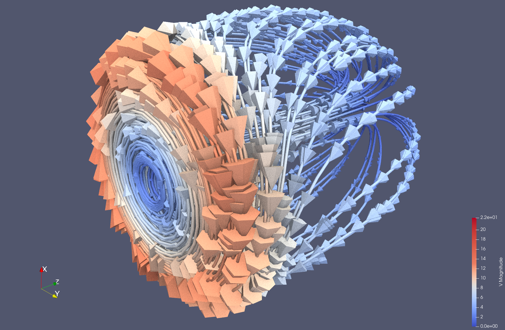
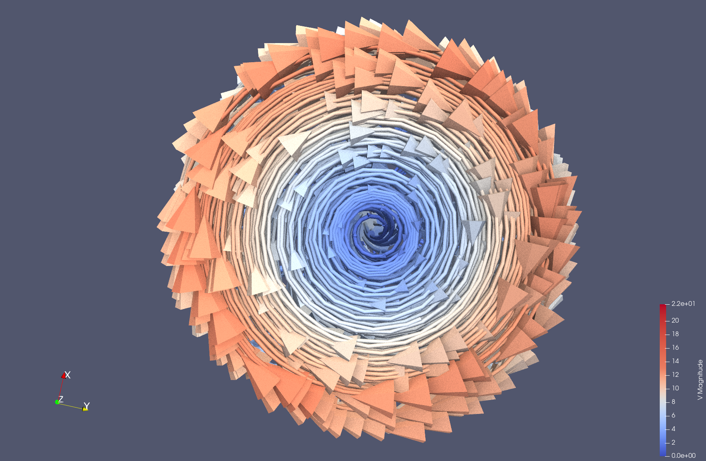
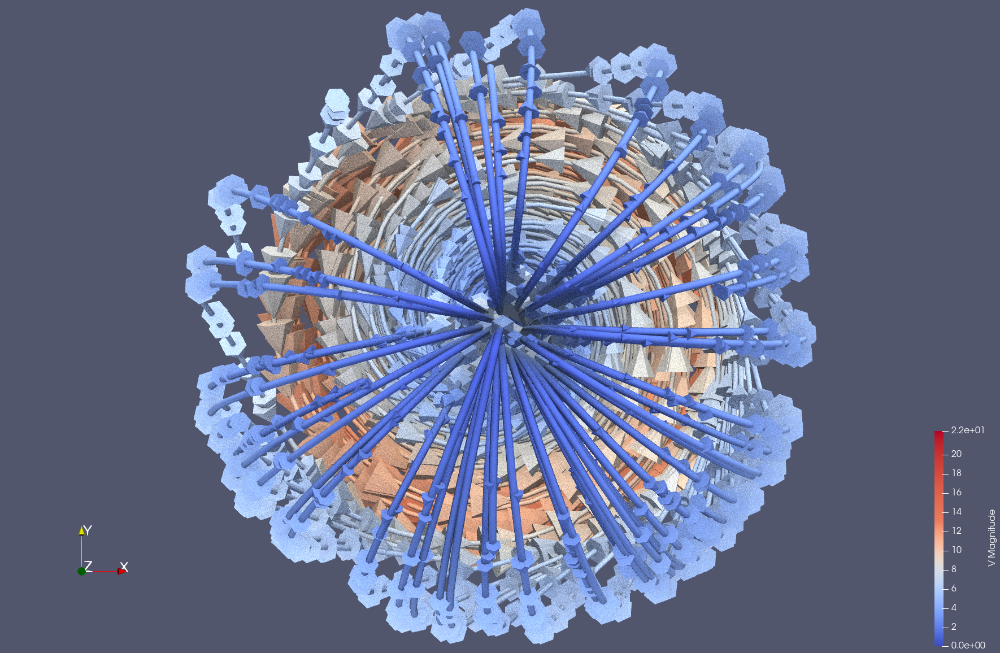

---
elm:
  dependencies:
    gicentre/elm-vegalite: latest

narrative-schemas:
  - coursework
---

Author: Alistair Grom - 964398
 
Before using these sets of documents, make sure you have everything installed
correctly. Installation instructions are here:
<https://github.com/gicentre/litvis/blob/main/documents/tutorials/introduction/installingLitvis.md>.

{(aim|}

This visualisation is from the Paraview Examples folder filename <code>"disk_out_ref.ex2"</code> . This dataset is a simulation of the flow of air around a heated and spinning disk.
The attribute from this dataset I have used is the Velocity, V. From these values I have traced the velocities of the air flowing around the spinning disk.
From the visualisation we can see that the air velocity is fast at the edges but as it travels inwards to the center of the cylinder it slows. Then as it passes through the center out to the other end of the cylinder. Once the air exits the end of the cylinder it travels to the other end where the air speeds up again, completing the cycle.

{|aim)}

{(vistype|}

Flowvis, Tube and Glyph representation of air speed.

{|vistype)}

{(vismapping|}

<li>Colour - The mapping of light blue (low velocity) to red (high velocity) on a linear scale. This is the default colour mapping in Paraview.</li>
<li>Tube - To aid the visibility of the streams. The tubes have a radius of 0.034.</li>
<li>Glyph - To show the velocity and direction of the air flow. The glyphs have a scale factor of 0.053.</li>
<li>This has been rendered with raytracing.</li>

{|vismapping)}

{(dataprep|}

<li>I have only selected to visualise the velocity so have only checked that set of variables in the Properties tab of Paraview.</li>
<li>I have also selected a surface representation for the data, both the glyphs and the tube streams use this representation.</li>
<li>Stream Tracer - To trace the lines of the airflow. This filter has been left default.</li>

{|dataprep)}

{(limitations|}

Possibly a animated view of the air would show the user a more immediately obvious air flow demonstration. 
Including a representation of the disk itself could improve the story of the data. To show the user what the air is flowing from. However, I do not feel that these limitations take away from what my visualisation achieves.

{|limitations)}

