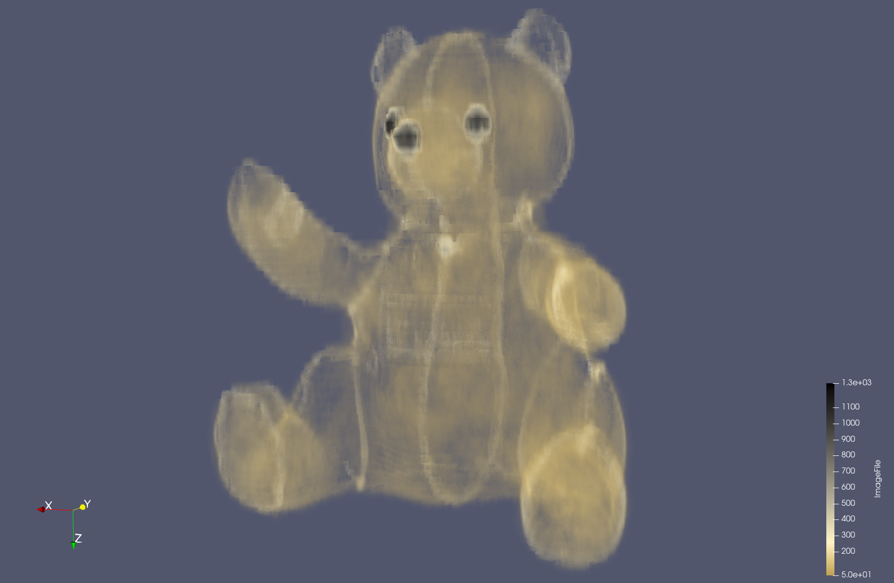

Put your 1st data1 design concept here

{(aim|}

This visualisation is mainly to make sense of the dataset. We are given a quite sparse looking dataset that on the face of it seems to only really have a oval outline throughout the slices. 
The dataset if of a traditional teddy bear with button eyes and nose.
 
The aim with this visualisation was to achieve a smoother texture akin to that of the traditional teddy bear. This visualisation shows the user how the components are assembled on a teddy bear. The stitching is visible on the limbs and through the middle of the bear. We also see the eyes and nose being shown more clearly as they, as well as the stitching are more prominent on the scans in the dataset.

{|aim)}

{(vistype|}

Volume Visualisation

{|vistype)}

{(vismapping|}

<li>Colour - I have used a linear mapping of the values from ImageFile <ul>using the brown for the values that corresponded to fur, from the start of the colour scale</ul> <ul>white to represent the stitching, at data value: 243.97589111328125</ul><ul>black to represent the eyes and nose, at data value: 478.9156494140625</ul> </li>

<li>A volume representation is used to show these materials to the user. Making the parts that are less dense in the dataset transparent.</li>
 
<li>This has been rendered with raytracing and shadows.</li>

{|vismapping)}

{(dataprep|}

<li>Data Properties - Data Extent (0-511, 0-511, 0-62)</li>
<li>Threshold - To remove the box around the bear. Minimum = 50, Maximum = 1492. Remove anything under 50.</li>
<li>Calculator - I have scaled up the values in the Z-axis so that the bear is of proper scale. The formula =  <code>coordsX*iHat+coordsY*jHat+(8.24193548387)*coordsZ*kHat</code></li>
<li>Clip - I have used 2 clip filters to remove the mass behind the bear, this is a Plane clipping. In a formation of (/ \). They have both been inverted. <ul>Clip 1 - Origin: 257, 435.801, 255,5. Normal: 0.37, 0.9378, 0</ul><ul>Clip  2 - Origin: 219.679, 426, 255.633. Normal: -0.195, 0.9808, 0</ul></li>

{|dataprep)}

{(limitations|}

The parts such as stitching could be more prominent in the vis as they too have some transparency which I would have prefered to have slightly less of. 
This could be sharper in detail with more close up views.

{|limitations)}
