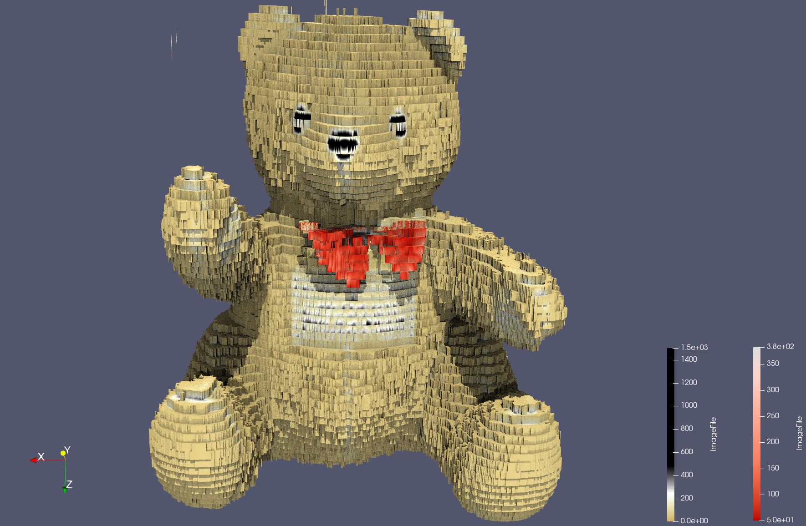
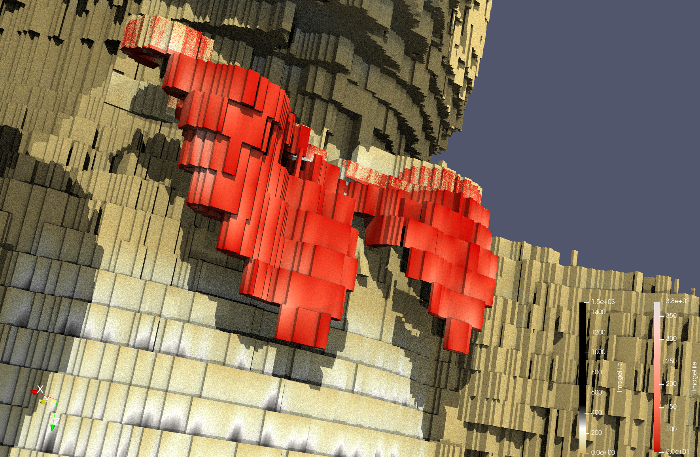
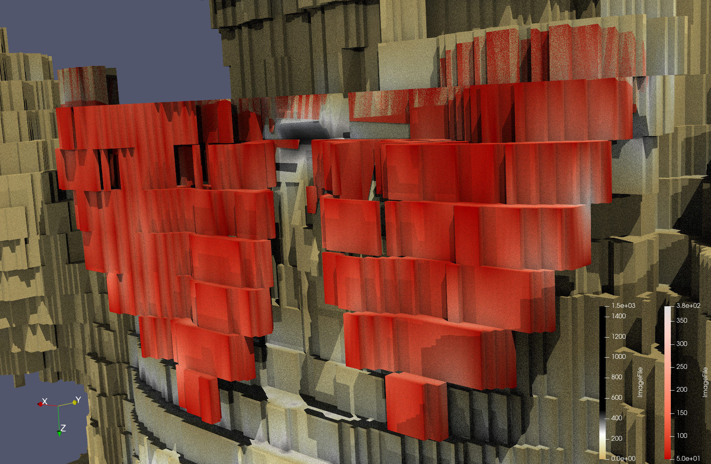

Put your 2nd data1 design concept here

{(aim|}

This visualisation looks to show the bear in a more common 3d object of a teddy bear. When looking at the surface I noticed that there was a bow on the bear, something that I had not realised after creating the data1_1 visualisation. When applying the surface representation of this data I saw this feature and wanted to bring the users attention to it. 
The bow has been separated out from the rest of the bear and coloured in red as is the norm for a bear like this. Using ray tracing and shadows really allows us to see how the bow is protruding from the bear as it leaves a shadow behind.

{|aim)}

{(vistype|}

Surface Visualisation

{|vistype)}

{(vismapping|}

<li>Colour (Bear) - I have used a linear mapping of the values from ImageFile <ul>using the brown for the values that correspond to fur, from the start of the colour scale</ul> <ul>white to represent the stitching, at data value: 243.97589111328125</ul><ul>black to represent the eyes and nose, at data value: 478.9156494140625</ul> </li>
<li>Colour (Bow) - To create a region that can be coloured independently I used an ExtractByCells filter on the box clip of the bow (Clip 3). Then gave it a linear mapping with red starting at datavalue = 50.</li>
<li>This has been rendered with raytracing and shadows.</li>
<li>This visualisation uses a Surface mapping for all visible components.</li>

{|vismapping)}

{(dataprep|}

<li>Data Properties - Data Extent (0-511, 0-511, 0-62)</li>
<li>Threshold - To remove the box around the bear. Minimum = 50, Maximum = 1492. Remove anything under 50.</li>
<li>Calculator - I have scaled up the values in the Z-axis so that the bear is of proper scale. The formula =  <code>coordsX*iHat+coordsY*jHat+(8.24193548387)*coordsZ*kHat</code></li>
<li>Clip - I have used 2 clip filters to remove the mass behind the bear, this is a Plane clipping. In a formation of (/ \). They have both been inverted. <ul>Clip 1 - Origin: 257, 435.801, 255,5. Normal: 0.37, 0.9378, 0</ul><ul>Clip  2 - Origin: 219.679, 426, 255.633. Normal: -0.195, 0.9808, 0</ul></li>
 
 ^ These are the same as the previous visualisation.
 
<li>Additional Clipping - I have used a clipping filter to clip the bow of the total dataset and then done this for the separate bow to colour it independently, these are Box clippings.<ul>Clip 3 - Clip Type: Box, Position: 150, 215, 200. Rotation: 20, -1.3797, -1. Length: 150, 50 , 70. Inverted.</ul><ul>Clip 4 - Clip Type: Box, Position: 150, 215, 208.69. Rotation: 20, -1.3797, -1. Length: 150, 50 , 70. <b>NOT Inverted.</b> To take away from the bear.</ul></li>

{|dataprep)}

{(limitations|}

I would have liked to smooth the surface out, however when I tried to add a contour -> smooth filter (the way I found from an online resource) my program became unusable, it was really slow and would crash with a simple zoom or rotation of the camera view.

{|limitations)}
