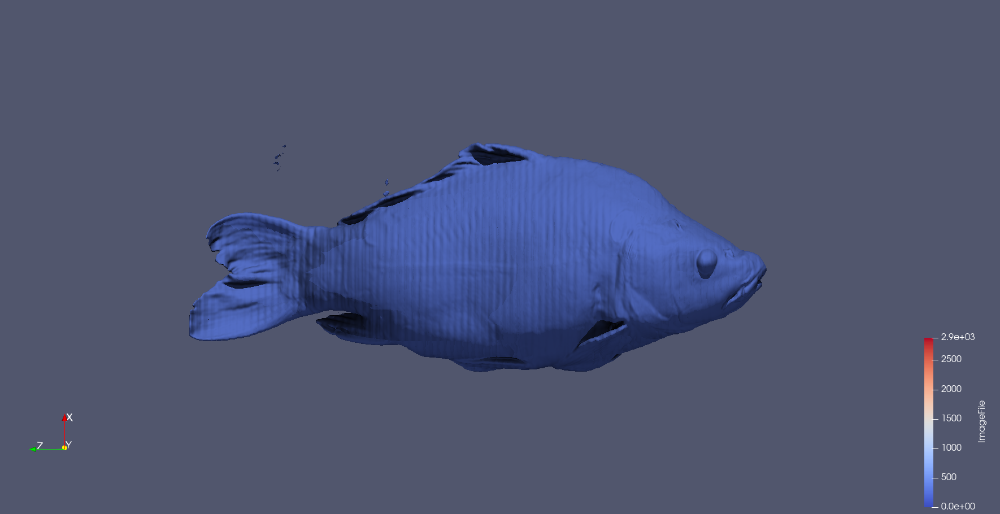

Put your 1st data2 design concept here

{(aim|}

This dataset was a mystery upon looking at the slices of the <code>.raw</code> datafile. I had seen some CT scans of a skull before and it struck me quite quickly this was a bone structure of some type. After applying a contour filter it became obvious that it was a fish.
 
This visualisation intends to show the user the bone structure of a fish in comparison to the skin structure of the fish and how they are separate in density. By adding a gif representation the user can see the entire 360 degree view of the fish with skin and bone. 
 
We are really able to see how fish have a very small brain indicated by the small region of space amongst the dense head area. Also from my visualisation this fish does not seem to have prominent teeth.

{|aim)}

{(vistype|}

Isosurface reveals bone behind skin.

{|vistype)}

This is a gif ^

{(vismapping|}

<li>Colour - The Colour Map I have used is the default Paraview colour map. (Cool to Warm). I found that this represented the fish quite well. Even when just fitted to the data with no additional editing. 0 being the start and 2900 being the end.</li>
 
<li>Camera - This visualisation uses an animation of the camera orbiting around the fish. I have created a Camera orbit animation with time length 2.</li>
 
<li>Wireframe - To show both the skin and bone in one image I have used a wireframe representation on the skin at isosurface value 300. The bone is using a surface representation at isosurface value 1300. This particular image does not use ray tracing to enhance visual clarity.</li>
 
<li>This has been rendered with raytracing and shadows.</li>

{|vismapping)}

{(dataprep|}

<li>Data Properties - Data Extent (0-255, 0-255, 0-511)</li>
<li>Contour <ul>For the skin I have used a contour filter with an isosurface value of 300.</ul>
            <ul>For the bones I have used a contour filter with an isosurface value of 1300. </ul> 
            <ul>Choosing these values means we are only looking at the skin an bone rather than any organs or other things in the dataset.</ul>
            </li>
 
<li>Animated Contour - I have used an animated contour that will scroll through the isosurfaces to reveal the more dense bone under the skin. Using one of the contour layers that have been used to represent the skin and bone separately.<ul>At time 0.5 I set the value of the isosurface to be 300.</ul><ul>At time 1.5 I set the value of the isosurface to be 1300.</ul>This allows the user to see both the bone and skin for longer so it does not just change before the user can make sense of the visualisation. This twinned with the orbit vismapping makes the visualisation.</li>

{|dataprep)}

{(limitations|}

I would prefer this to be interactive rather than just a sweeping gif but I'm not really sure how to do this. 
Having more zoomed in views of the gif moving slower focussing on different parts of the fish could be useful to the observer.

{|limitations)}
