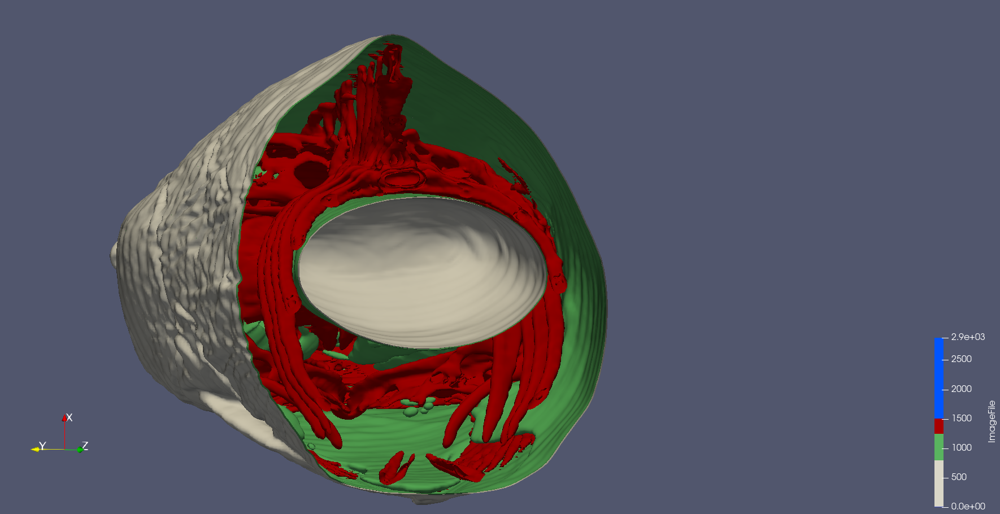
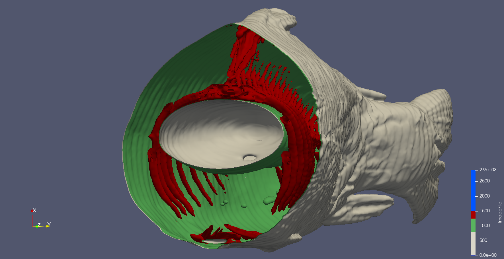

Put your 2nd data2 design concept here

{(aim|}

This visualisation looks at the cross-section of the fish. Using a slicing filter through the z-axis we are able to see the different isosurface values separated by colour. 
This visualisation is looking at the skeleton and the organs of the fish, skeleton red organs are green and white. We are able to see the fish 'hollow' areas such as the air bladder/swim bladder and stomach are placed around the skeleton similar to how this is in humans with lungs and stomach.

{|aim)}

{(vistype|}

Cross-sectional slicing animation. Surface representation. Isosurface separation.

{|vistype)}

This is a gif ^
 

 

This is a gif ^
 

{(vismapping|}

<li>Colour - I have use a colour mapping to value for this data. Checking the Interpret Values as Categories.
<ul>Isosurface value 600 - White</ul>
<ul>Isosurface value 800 - Green</ul>
<ul>Isosurface value 1250 - Red</ul>
<ul>Isosurface value 1500 - Blue</ul></li>
<li>This visualisation uses the Surface representation for all visible layers.</li>
<li>This has been rendered with raytracing, <b>no</b> shadows.</li>
 
<li>I have used an animated clip that I describe in the dataprep section.</li>

{|vismapping)}

{(dataprep|}

<li>Data Properties - Data Extent (0-255, 0-255, 0-511)</li>
<li>Contour - I have used a contour filter with 4 different values, 600 for skin, 800 for the inside of the fish, 1250 for bones, 1500 anything more than bone. (largely not present)</li>
<li>Clipping - I have used a clipping filter to display the cross section of the fish. I have animated the z-axis (Clip 1 - Origin (2)) this by setting the start value at 511 at time 0 and then setting the value to 0 at time 2.</li>

{|dataprep)}

{(limitations|}

Having the air bladder and stomach as different colours would draw more attention to that feature. 
Potentially having more colours and isosurfaces represented could show more of the data of the fish. 

{|limitations)}
